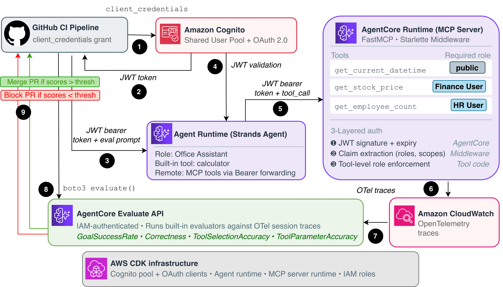

# AgentCore Evaluation Pipeline with MCP Role-Based Access Control

Reference implementation for running automated evaluations on an AgentCore-hosted agent that connects to an MCP server with role-based access control. The CI/CD pipeline deploys infrastructure, invokes the agent, runs evaluations, and gates the PR on quality thresholds.

## Architecture



## Auth Flows

**M2M (CI pipelines):** `client_credentials` grant → Cognito issues access token with scopes only → MCP `AuthMiddleware` sees scopes + no roles → bypasses role checks → all tools accessible.

**User-scoped (interactive):** `ADMIN_NO_SRP_AUTH` or `authorization_code` grant → Cognito issues access token with `custom:roles` claim (via pre-token-generation Lambda V2) → agent forwards token to MCP via `request_header_allowlist` → `AuthMiddleware` extracts roles → tool-level checks enforce access (e.g., only `FinanceUser` can call `get_stock_price`).

## MCP Auth Layers

1. **JWT validation (AgentCore):** Signature, issuer, expiry verified by the platform via `authorizer_configuration` before the request reaches your code.
2. **Header passthrough:** `request_header_allowlist=["Authorization"]` on both runtimes ensures the JWT reaches the agent and MCP containers.
3. **Role-based tool access (`AuthMiddleware`):** Uses `fastmcp.server.dependencies.get_http_headers()` to read the JWT, decodes claims, and enforces `custom:roles` against tool `meta`. M2M tokens (scopes but no roles) bypass role checks; user tokens must have the required role.

## Repo Structure

```
├── README.md                        # This file
├── app.py                           # CDK entry point
├── pyproject.toml                   # Root CDK dependencies
├── cdk.json                         # CDK config
├── agent/
│   ├── Dockerfile
│   ├── pyproject.toml
│   └── src/
│       └── assistant_agent.py       # Strands agent with MCP client
├── mcp-server/
│   ├── Dockerfile
│   ├── pyproject.toml
│   ├── server.py                    # FastMCP server with role-gated tools
│   └── src/
│       ├── auth/
│       │   ├── middleware.py        # AuthMiddleware for role-based tool access
│       │   ├── models.py           # AccessToken Pydantic model
│       │   └── utils.py            # Token parsing via get_http_headers()
│       └── exceptions.py
├── infrastructure/
│   ├── stack.py                     # CDK stack (Cognito + both runtimes)
│   ├── roles.py                     # IAM roles for AgentCore
│   └── pre_token_lambda/
│       └── index.py                 # Copies custom:roles into access tokens
├── fixtures/
│   └── sample_traces.json           # Pre-collected OTel traces
├── scripts/
│   ├── agentcore_eval.py            # Eval script (live invocation)
│   ├── evaluate_stored_traces.py    # Evaluate pre-collected fixtures
│   └── eval_dataset.json            # Test prompts
├── .github/
│   └── workflows/
│       └── agentcore-eval.yml       # CI/CD pipeline
└── notebooks/
    ├── 01_deploy_and_test_rbac.ipynb # Deploy + test role enforcement
    └── 02_evaluation_pipeline.ipynb  # Eval pipeline walkthrough
```

## Prerequisites

- AWS account with Bedrock AgentCore access
- CDK bootstrapped (`cdk bootstrap`)
- Docker installed and running
- Python 3.12+

## Quick Start

The fastest way to get started is via the notebooks:

1. Open `notebooks/01_deploy_and_test_rbac.ipynb` — deploys the stack, sets user passwords, and runs role-based access tests.
2. Open `notebooks/02_evaluation_pipeline.ipynb` — runs the evaluation pipeline with M2M token and quality gates.

## Deployment

```bash
# Install CDK dependencies
python3 -m venv .venv
source .venv/bin/activate
pip install .

# Deploy the stack
cdk deploy --outputs-file outputs.json
```

CDK outputs include: `SharedUserPoolId`, `M2MClientId`, `UserClientId`, `TokenEndpoint`, `MCPRuntimeId`, `MCPRuntimeArn`, `AgentRuntimeId`, `AgentRuntimeArn`.

## Testing

### Role-based access tests

Run the `notebooks/01_deploy_and_test_rbac.ipynb` notebook to deploy the stack and test role enforcement interactively.

### M2M (CI-style) invocation

```bash
# Get M2M token (client secret stored in Secrets Manager: agentcore/dev/m2m-client)
TOKEN=$(curl -s -X POST "$TOKEN_ENDPOINT" \
  -H "Content-Type: application/x-www-form-urlencoded" \
  -d "grant_type=client_credentials&client_id=$M2M_CLIENT_ID&client_secret=$M2M_CLIENT_SECRET&scope=agentcore/invoke" \
  | jq -r '.access_token')

# Invoke agent
curl -X POST "https://bedrock-agentcore.$REGION.amazonaws.com/runtimes/$(python3 -c "import urllib.parse; print(urllib.parse.quote('$AGENT_ARN', safe=''))")/invocations?qualifier=DEFAULT" \
  -H "Authorization: Bearer $TOKEN" \
  -H "Content-Type: application/json" \
  -d '{"prompt": "What is the stock price of AAPL?"}'
```

### Run evaluations locally

```bash
cd scripts
export AGENT_RUNTIME_ARN="..."
export AGENT_RUNTIME_ID="..."
export TOKEN_ENDPOINT="..."
export OAUTH_CLIENT_ID="..."
export OAUTH_CLIENT_SECRET="..."
export OAUTH_SCOPE="agentcore/invoke"
export EVAL_THRESHOLD="0.8"

pip install boto3 requests bedrock-agentcore-starter-toolkit
python3 agentcore_eval.py
```

## CI/CD Setup

1. Create an IAM role for GitHub OIDC with permissions to deploy CDK stacks, manage AgentCore runtimes, and invoke Cognito.
2. Add the role ARN as a GitHub secret: `AWS_ROLE_ARN`.
3. Push a PR to `main` — the workflow deploys, evaluates, posts results to the PR, and tears down automatically.

## Teardown

```bash
source .venv/bin/activate
cdk destroy --force
```
